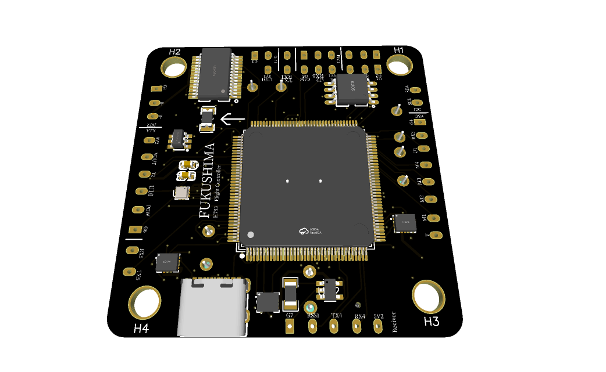

# FUKUSHIMA Series ArduPilot Configurations

Custom hardware definition files and pre-built binaries for industrial flight controllers.

## Support Hardware
- **FUKUSHIMA_H7**: STM32H743 based, 6-layer high-density PCB.
- **FUKUSHIMA_F7 / F7-Agri**: STM32F722 based, optimized for industrial and agricultural UAVs.

## Engineering Highlights
- **Mission-Critical Stability**: OSD disabled for maximum CPU/Memory reliability.
- **Enhanced Logging**: DataFlash logging enabled for tactical flight analysis.
- **Advanced Build**: Fully validated on H7 (2048KB Flash) and F7 platforms.
- 

## Contact
Custom flight controller design and ArduPilot integration:
syhc5weav@gmail.com

**[FUKUSHIMA-UAV Project Inquiry Form](https://forms.gle/Fcoec4LH6zp5pdDA9)**

##  Hardware Overview

### FUKUSHIMA_H7 (STM32H743)
High-performance flight controller with 6-layer PCB design.

### FUKUSHIMA_F7 (STM32F722)
Optimized for industrial and agricultural UAV applications.

Developed by **FUKUSHIMA-UAV** | Custom UAV Solutions
